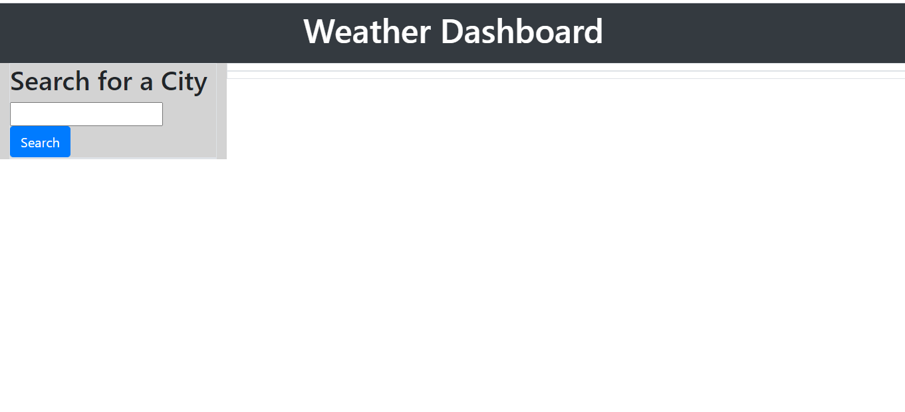
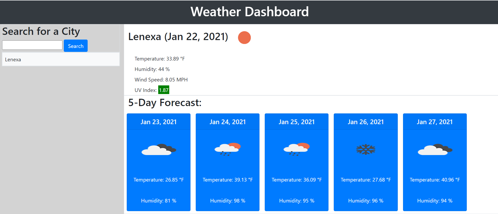
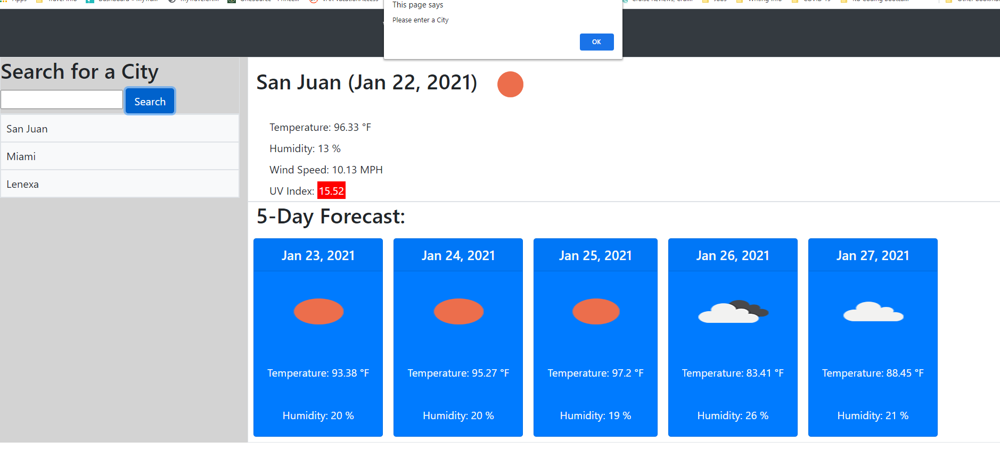
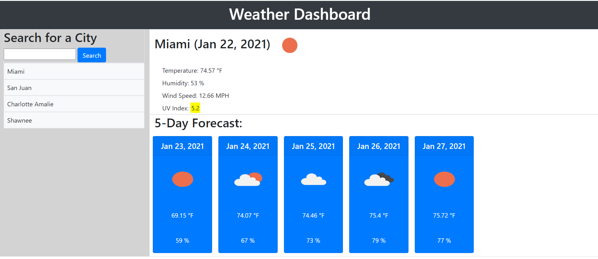
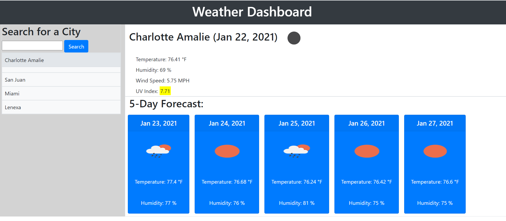
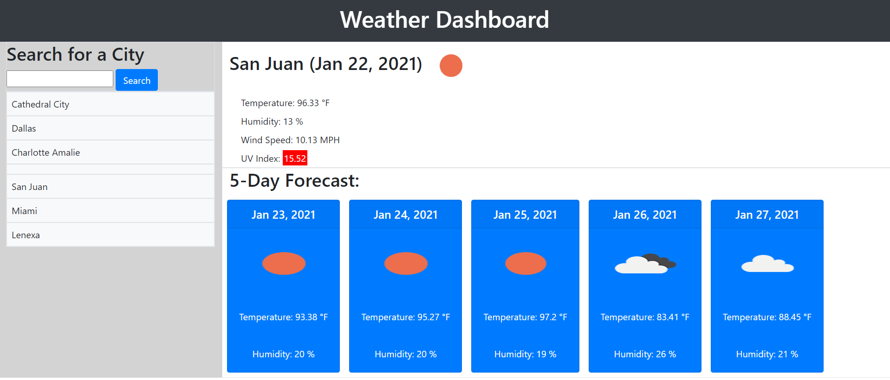

# WeatherDashboard
Weather Dashboard version 2
homework #6

### Requirements and User Story

- Use the OpenWeather API to retrieve weather data for cities. 
- Use localStorage to store any persistent data.

#### User Story
AS A traveler

I WANT to see the weather outlook for multiple cities

SO THAT I can plan a trip accordingly.

#### Acceptance Criteria
GIVEN a weather dashboard with form inputs

WHEN I search for a city

THEN I am presented with current and future conditions for that city and that city is added to the search history

WHEN I view current weather conditions for that city

THEN I am presented with the city name, the date, an icon representation of weather conditions, the temperature, the humidity, the wind speed, and the UV index

WHEN I view the UV index
THEN I am presented with a color that indicates whether the conditions are favorable, moderate, or severe

WHEN I view future weather conditions for that city

THEN I am presented with a 5-day forecast that displays the date, an icon representation of weather conditions, the temperature, and the humidity

WHEN I click on a city in the search history

THEN I am again presented with current and future conditions for that city

WHEN I open the weather dashboard

THEN I am presented with the last searched city forecast

## Development Information

I used the following resources:
- Bootstrap 4.5.3
- Fontawesome kit
- OpenWeather API's
- Cloudflare ajax libraries for jquery, bootstrap & moment

When the user first opens the Weather Dashboard this is what is presented:

The user will then enter a valid city name and click on the Search button.

If the search button is clicked with no city entered the user receives an alert asking them to Please enter a city.

Once a city name is entered that city is retained in local storage and is available to be 'retriggered'. 

If a blank city is entered there will be a blank line in the city list.

To check the current weather and 5 day forecast from a city in local storage the user will click on the city from the list and the Dashboard will update with that city's weather.

## Candidates for Future Enhancements -
- Include state name with city name to ensure correct location. 

